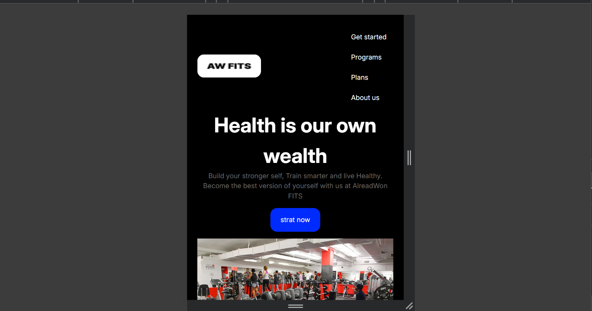
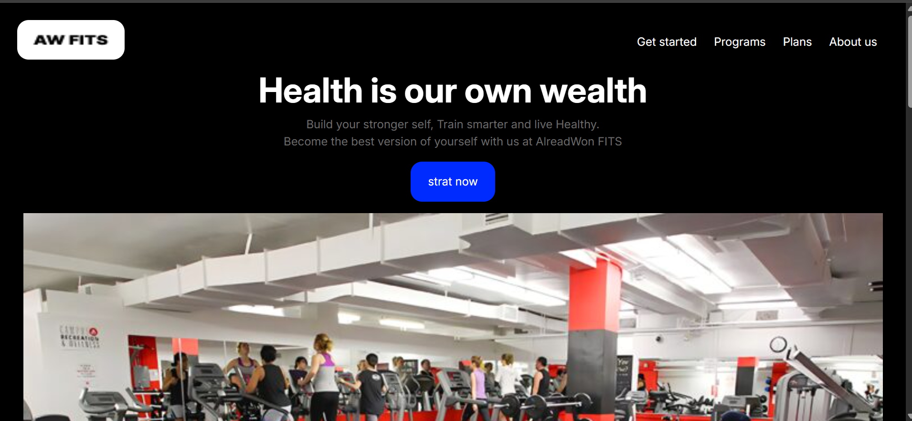

This is a solution to [Landing webpage of AlreadyWon Gym]

## Table of contents

- [Overview](#overview)
  - [Screenshot](#screenshot)
  - [Links](#links)
- [My process](#my-process)
  - [Built with](#built-with)
  - [What I learned](#what-i-learned)
  - [Continued development](#continued-development)
  - [AI Collaboration](#ai-collaboration)
- [Author](#author)

## Overview

As i continue to improve my skills in fronte end, i decided to take a challenge of a gym landing page.I buit the project with symathic HTML and CSS from scratch.

## screenshot

### Links

[solution URL](https://github.com/mbah-create/gym-landing-page)
[live site URL](https://mbah-create.github.io/gym-landing-page/)

## My process

### Built with

- Semantic HTML5 markup
- CSS3
- CSS reset
- :root color variables
- Flexbox
- Desktop-first workflow
- Responsive design
- Google fonts (inter)
- hover and focus visible

### What I learned

- media screen to sections in the webpage
  that needs to be responsive to smaller devices.
- how to use id's,section and class.
- include a logo in a header.
- style button
- use label and stlye it.

### Continued development

I want to improve my front end knowledge with more full projects like landing page, websites, webapp.

### AI Collaboration

I used chatgpt as a collaborator and as a learning assitant throughout this project.Rather than asking it to genertae the solutions and give me blogs of code,i used it to undertand HTML and CSS concepts such as CSS BOX model, flex box, respomsive images, dev tools,The expalaination helped me understand why certain techniques were used so that i could implement and the process.

## Author

- github - (https://github.com/mbah-create/gym-landing-page)
- LinkedIn - [mbah fabrice](https://www.linkedin.com/in/mbah-fabrice-93849a379)
